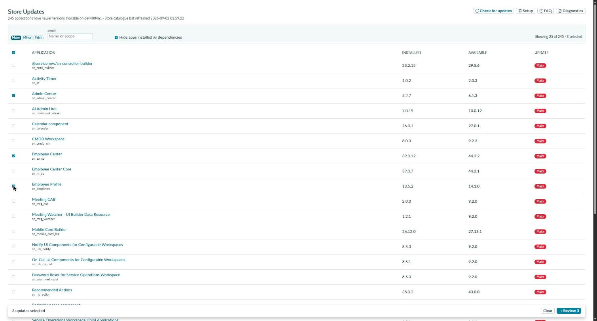
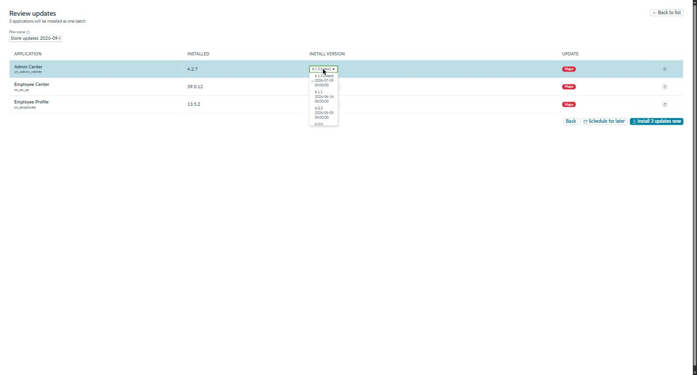
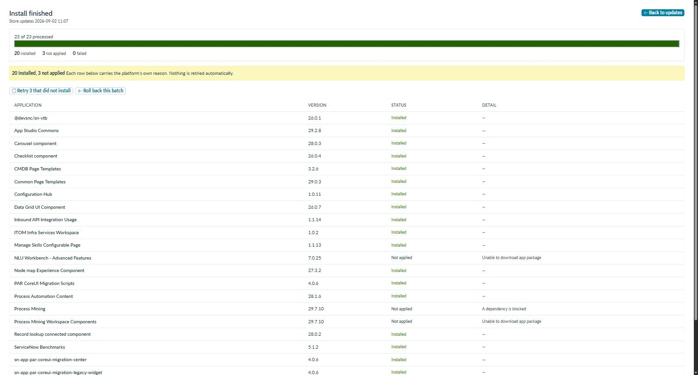
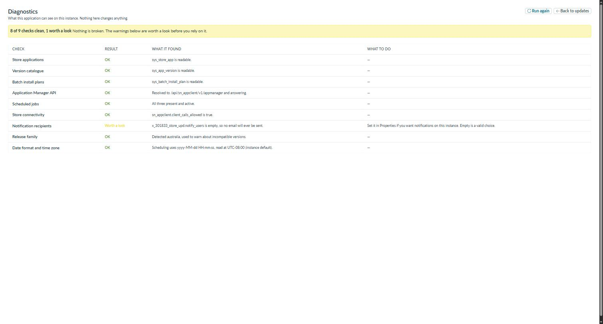

# Store Update Manager

**Batch-install ServiceNow Store updates.** Lists every installed Store application with a newer version
available, lets you bulk-select them, and installs them as one batch with live per-application progress.

[](CHANGELOG.md)
[](LICENSE)
[](https://developer.servicenow.com/dev.do#!/reference/now-sdk)



---

## The problem

Any long-lived instance ends up sitting on a few hundred Store applications with newer versions
available — the instance this was built against had 269. The out-of-the-box Application Manager installs
them one at a time.

## What it does

- **Lists what needs updating**, filtered by major / minor / patch, with dependency-installed
  applications hidden by default.
- **Bulk select**, including select-all-shown and a one-click "select all patches".
- **Choose the version**, not just the latest — every published version newer than what is installed.
- **Installs as one batch** and shows live per-application progress with the platform's own reason when
  something is skipped.
- **Schedules for a maintenance window**, because an install locks the instance while it runs.
- **Emails** when a batch finishes, and a periodic digest of what is waiting.
- **Retries what failed**, and links into the platform's rollback screen.

## What it leverages

Most of this is not custom code, which is the point:

| Concern | Handled by |
|---|---|
| Batch installation | `sys_batch_install_plan` / `sys_batch_install_item` — platform tables |
| Submitting an install | The `sn_appclient` scripted REST API |
| What is available | `sys_store_app` and `sys_app_version`, read at request time |
| Install history | The platform's own records — installs started from the OOTB Application Manager appear here too |
| Rollback | The platform's rollback context, linked to rather than reimplemented |

**It creates no tables.** The update list is derived, not stored. The only state the application owns is
a handful of system properties, two of which are watermarks for the notification jobs.

**Calls run in the browser under the operator's own session**, so there is no cross-scope script and no
outbound API spend.

### The one piece that had to be built

A daily job to refresh the Store catalogue. ServiceNow ships one — `Check Scoped App Updates` — but it
is inactive *and* protected (`sys_policy = read`), so no admin can switch it on; activating it fails with
*update failed due to security constraints*.

This application ships its own, calling the same public `sn_appclient.UpdateChecker` API. Deliberately
**without** the platform's auto-install tail, which installs everything flagged `auto_update` with nobody
pressing anything. Refreshing a catalogue and installing software are different decisions.

## Screens

| | |
|---|---|
|  | **Review** — pick a specific version per application, see what is blocked or incompatible before committing. |
|  | **Installer** — per-application state and the platform's own reason. The batch id is in the URL, so closing the tab and reopening the link rejoins the same run. |
|  | **Diagnostics** — read-only preflight for an instance nobody has run this on. |

## Requirements

- The **admin** role. The platform's install API refuses a caller holding only
  `sn_appclient.app_client_company_installer`, so this is admin-only by design rather than by omission.
- An instance that can reach the ServiceNow Store.
- Tested on the **Australia** release family. It leans on platform internals (see
  [ADR-001](docs/adr/ADR-001-ootb-batch-installer-no-new-tables.md)) which may move between families —
  the built-in **Diagnostics** page will tell you if something has.

## Install

Download the packaged application from
[Releases](../../releases) and install it as you would any scoped app, or build from source:

```bash
npm install
npx now-sdk auth --add https://<your-instance>.service-now.com --type basic
npm run build
npm run deploy
```

Then open **All → Store Update Manager → Diagnostics** and confirm it comes back clean.

Full walkthrough: the **Setup Guide** inside the application, or
[docs/TESTING.md](docs/TESTING.md) for a structured first-run script.

## Configuration

Everything that could differ per instance is a system property, listed under
**Store Update Manager → Properties**.

| Property | What it does | Default |
|---|---|---|
| `notify_users` | Comma-separated user names or sys_ids. **Empty means no email is ever sent.** | *(empty)* |
| `notify_on_batch_finish` | Email when a batch install reaches a final state | `true` |
| `digest_frequency` | `off`, `weekly` or `monthly` summary of what is waiting | `weekly` |
| `digest_min_level` | Lowest level worth an email: `patch`, `minor`, `major` | `patch` |
| `hide_dependencies_by_default` | Hide applications installed as a dependency | `true` |
| `progress_poll_seconds` | How often the installer view re-reads progress | `4` |

Notifications are silent until `notify_users` has a value. A freshly installed application on a new
instance should not start emailing people.

## What it deliberately doesn't do

- **No release notes.** The Store does not publish them to the instance —
  `sys_app_version.short_description` is the application's standing blurb, identical on every release,
  and `manifest` is empty. Instead you get the version ladder, publish dates, per-version dependencies
  and a compatibility warning against your release family.
- **No auto-install.** Nothing is installed that was not selected.
- **No delegated role.** See Requirements.

## A note on the scope prefix

The application scope is `x_301833_store_upd`. The `301833` is the vendor prefix of the personal
developer instance it was built on — ServiceNow assigns these per instance and they cannot be chosen
freely. It is cosmetic and the application works regardless, but if you would rather it carried your own
prefix, rebuild from source with `now-sdk init --scopeName x_<your code>_store_upd` and search-replace
the scope string, which also appears in the property names, the UI Page endpoint and the module filters.

## Design decisions

The reasoning behind the shape of this is recorded as ADRs, including the routes that were rejected and
why — worth reading before changing anything structural:

- [ADR-001 — Build on the platform's own batch installer, no new tables](docs/adr/ADR-001-ootb-batch-installer-no-new-tables.md)
- [ADR-002 — Notifications by polling, and nothing instance-specific in the code](docs/adr/ADR-002-notifications-and-portability.md)
- [ADR-003 — Ship our own Store update check job](docs/adr/ADR-003-own-update-check-job.md)

## Built with

[ServiceNow Now SDK](https://developer.servicenow.com/dev.do#!/reference/now-sdk) — a React UI Page using
`@servicenow/react-components` and the Horizon design system, so it follows the instance theme including
dark mode.

```
src/
  client/          React page — three views on one URL (?view=updates|review|install)
  server/          Notification jobs (module)
  scripts/         The daily Store check (plain server script)
  fluent/          UI Page, application menu, properties, events, notifications, jobs
```

## Contributing

Issues and pull requests welcome. If you are changing something structural, read the ADRs first — most
of the non-obvious decisions have a recorded reason, and several of them reverse an earlier one.

## Licence

[MIT](LICENSE)
